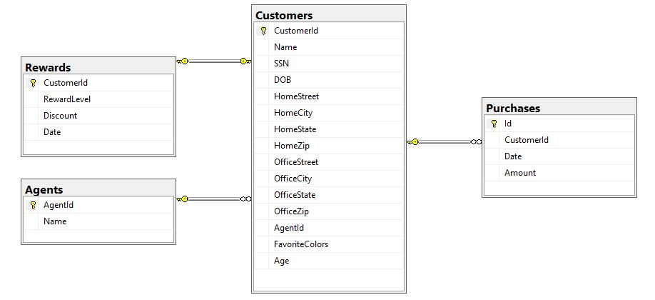
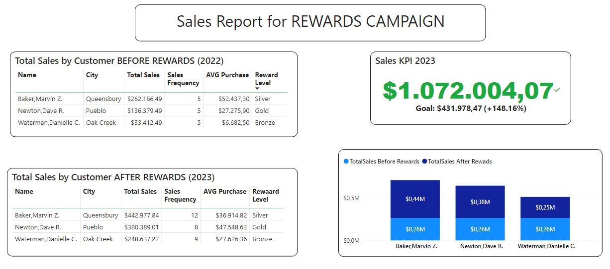

# Customer Rewards Telecom Project

# PREMISE:

A huge telecommunication company had a successful year and just recently started a new campaign to
reward their loyal customers (provided) with a discount on new purchases. Each day for one week
agents have to fill out the custom form to reward some of them with a daily limit of 5 customers per
agent. Mistakes are possible.
One month after this campaign they will get a .csv report with customers that have made a successful
purchase and they want to merge this data to show the results through API. 

(SAOP Service used to gather Customers data)

# APIs

## Agents
1. `POST /api/Agents/InsertAgentsIntoDB`: Insert Agents into Database by their Name
## Customers
2. `GET /api/Customer/FindPerson/{id}`: Get Customer by ID from SOAP Services
3. `POST /api/Customer/InsertCustomerIntoDatabaseFromSOAPService`: Insert Existing Customer into Database directly from SOAP service
4. `POST /api/Customer/InsertNewCustomerIntoDatabase`: Insert New Customer into Database
## Reporting
5. `POST /api/Reporting/UploadReport`: Inserts (appends) Sales Report file (.csv) into database
## Rewards
6. `POST /api/Rewards/AllocateRewards`: Inserting/Updateing Rewards Level and Discount for Customers
## PowerBI
7. `GET /api/PowwerBI/GetSalesBeforeRewards`: Getting sales data from Database for PowerBI report (before rewards)
8. `GET /api/PowwerBI/GetSalesAfterRewards`: Getting sales data from Database for PowerBI report (after rewards)

## USE CASE:
Easy Customer integration into CRM, or any other System Integration.

## Tech used:
- C#
- .NET WEB API
- Entity Framework
- SOAP Service

## Usage

To use this project, follow these steps:
- Clone the repository.
- Create appsettings.json file and insert database connection
- Run the migration (dotnet ef migrations add FinalMigration, dotnet ef database update)
- Open the PowerBI report file and connect it to your database.

## Additional files provided
PowerBI .pbix file (replace url within Power Query if running on other port)

## Database Schema

## PowerBI Report

